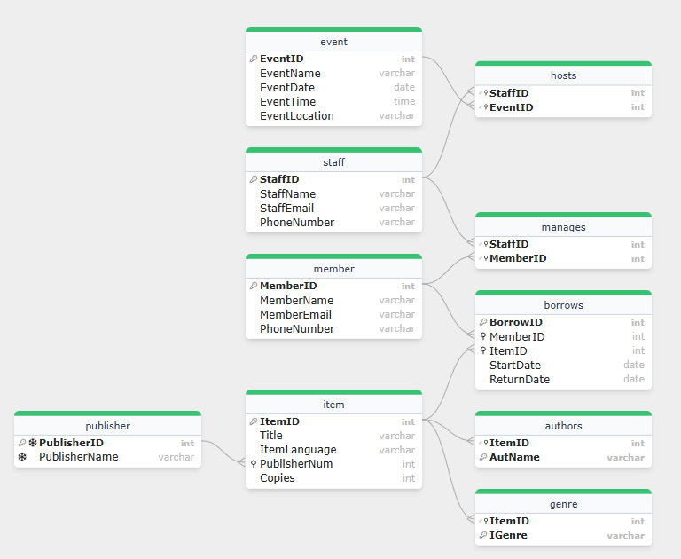
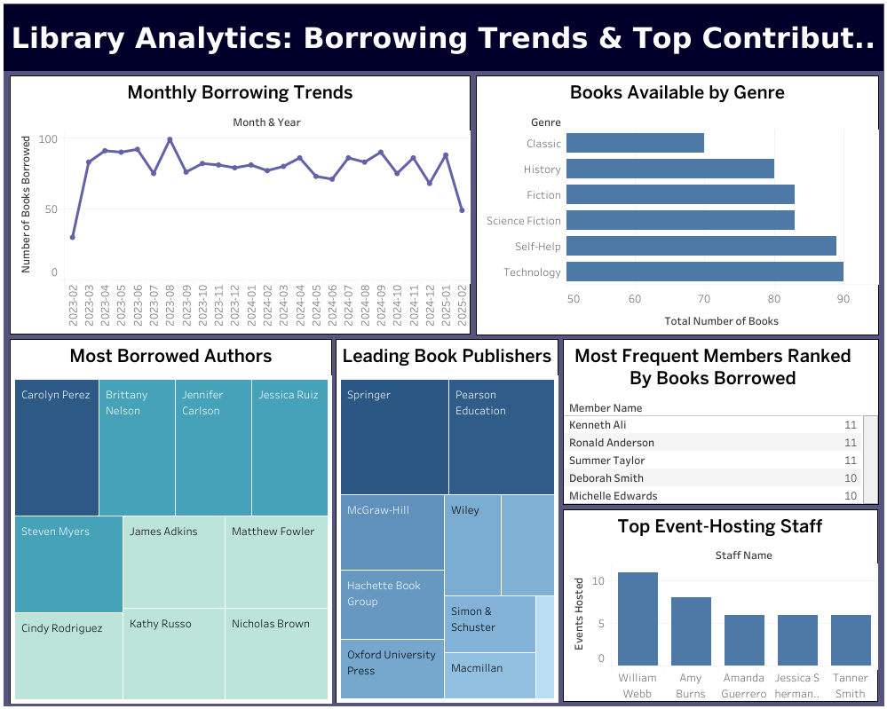
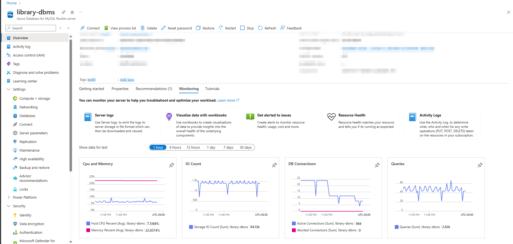

# Library Management System with Azure MySQL

A cloud-based library management system built using Azure MySQL for database storage and management. This system allows libraries to manage books, members, staff, events, and borrowing activities efficiently.

🔗 **[Click here to view the dashboard on Tableau Public](https://public.tableau.com/views/LibraryDatabaseAnalytics/Dashboard1?:language=en-US&:sid=&:redirect=auth&:display_count=n&:origin=viz_share_link)**

## Overview

This system provides a complete database solution for libraries with the following features:
- Item management (books with details like title, language, publisher, copies)
- Member and staff management
- Event coordination and tracking
- Borrowing and returning process
- Analytics and reporting

## Database Schema

The database consists of the following tables:
- **publisher**: Stores information about publishers
- **item**: Contains details about library items (books)
- **genre**: Associates items with their genres
- **authors**: Links books to their authors
- **member**: Stores library member information
- **staff**: Contains staff member details
- **event**: Tracks library events
- **borrows**: Records borrowing activities
- **hosts**: Links staff members to events they host
- **manages**: Associates staff members with members they manage

## Key Features

- **Comprehensive Member Management**: Track member details and borrowing history
- **Item Tracking**: Monitor available copies and popular items
- **Event Management**: Schedule and manage library events
- **Staff Coordination**: Assign staff to events and member management
- **Analytics**: Generate insights about borrowing patterns and popular items

## Database Operations

The system supports various operations through SQL queries and stored procedures:
- Adding new members, items, and events
- Tracking borrowing history
- Identifying popular items and genres
- Managing inventory and low-stock alerts
- Analyzing member borrowing patterns

## Screenshots

### Entity Relationship Diagram

### Analytics Dashboard

### Azure Database Usage

